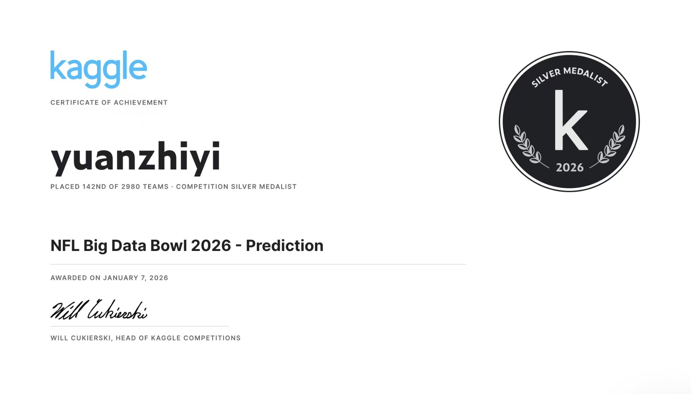

# NFL Big Data Bowl 2026 - 球员轨迹预测



**竞赛成绩**：Silver Medal（银牌） | **排名**：142nd / 2980 teams (Top 4.8%)

**获奖日期**：2026年1月7日

---

## Situation（背景与问题）

### 竞赛背景

NFL Big Data Bowl 2026 是由美国国家橄榄球联盟（NFL）主办的年度数据科学竞赛。本届竞赛的核心任务是预测橄榄球比赛中球员在投球后的移动轨迹。

### 问题定义

给定球被抛出前的球员跟踪数据（位置、速度、方向等），预测投球后每个球员在未来最多 94 帧（约 9.4 秒）内的位置坐标 (x, y)。

**输入数据**：
- 投球前 10 帧的球员跟踪数据
- 球员信息（身高、体重、角色等）
- 球落点坐标
- 场地信息

**输出要求**：
- 每个球员在投球后每一帧的 x, y 坐标
- 预测帧数因 play 而异（10-94 帧不等）

**评估指标**：
- RMSE（均方根误差）：预测位置与真实位置的欧氏距离

### 核心挑战

1. **多智能体交互**：多个球员同时移动，相互影响
2. **变长序列**：不同 play 的持续时间不同（10-94 帧）
3. **高维特征空间**：需要整合位置、速度、加速度、角色、球员交互等多种信息
4. **物理约束**：预测需要符合物理规律（速度、加速度限制，场地边界等）

---

## Task（我的任务与目标）

### 目标

开发一个高精度的球员轨迹预测模型，在 RMSE 指标上超越传统方法，进入竞赛前5%。

### 关键约束

- 模型需要处理变长输入和输出序列
- 预测必须满足物理约束（场地边界、速度限制等）
- 需要实时推理能力以支持潜在应用
- 必须具有一定的可解释性

### 创新方向

我观察到纯数据驱动的深度学习方法存在以下问题：
1. **数据效率低**：需要大量数据才能学习基本的物理规律
2. **泛化能力有限**：在训练集中未见过的战术配置上表现不稳定
3. **训练不稳定**：从零开始学习复杂的时空依赖关系

因此，我决定探索将领域知识（物理规则）与深度学习相结合的混合方法。

---

## Action（我的解决方案）

### 核心创新：几何神经混合方法

我提出了一种将物理几何规则与深度学习相结合的混合方法：

```
最终预测 = 几何基线（物理规则） + 深度学习修正（数据驱动）
```

#### 1. 几何基线设计

基于对橄榄球比赛的观察，我设计了三条简单的几何规则：

**规则 1：接球手向球落点移动**
```python
geo_endpoint_x = ball_land_x
geo_endpoint_y = ball_land_y
```
接球手的首要目标是接到球，因此在理想情况下会直线向球的落点移动。

**规则 2：防守球员镜像接球手**
```python
mirror_offset_x = defender_x - receiver_x
mirror_offset_y = defender_y - receiver_y
geo_endpoint_x = ball_land_x + mirror_offset_x
geo_endpoint_y = ball_land_y + mirror_offset_y
```
在人盯人防守中，防守球员会保持与接球手的相对位置关系，因此防守球员的目标位置应该是球落点加上当前的相对偏移。

**规则 3：其他球员遵循惯性**
```python
time_remaining = num_frames_output / 10.0
geo_endpoint_x = current_x + velocity_x × time_remaining
geo_endpoint_y = current_y + velocity_y × time_remaining
```
不直接参与传球的球员（如阻挡球员）通常会保持当前的运动状态。

#### 2. 深度学习修正

几何基线提供了理想情况下的预测，但实际中存在需要修正的因素：

- **防守压力**：接球手被贴身防守时无法直线移动
- **球员碰撞**：需要避开其他球员
- **战术变化**：假动作、区域防守等战术调整
- **体能限制**：不同球员的最大速度和加速度不同

为此，我设计了 13 个几何特征来描述当前状态与几何基线的偏差：

| 特征 | 含义 |
|-----|-----|
| geo_endpoint_x/y | 几何规则计算的目标位置 |
| geo_vector_x/y | 当前位置到几何终点的向量 |
| geo_distance | 到几何终点的距离 |
| geo_required_vx/vy | 达到几何终点所需的速度 |
| geo_velocity_error_x/y | 当前速度与所需速度的误差 |
| geo_required_ax/ay | 达到几何终点所需的加速度 |
| geo_alignment | 当前速度与几何路径的对齐度 |
| geo_receiver_urgency | 接球手到达球的紧迫度 |
| geo_defender_coupling | 防守球员与接球手的耦合强度 |

### 模型架构

我采用了 ST-Transformer（Spatio-Temporal Transformer）作为主干网络：

```
输入序列 (Batch, 10 frames, 167 features)
    ↓
特征投影 (167 → 128)
    ↓
位置编码（可学习）
    ↓
Transformer Encoder
  - 4 个注意力头
  - 2 层编码器
  - 前馈维度 512
    ↓
注意力池化 (10 frames → 1 context vector)
    ↓
ResidualMLP Head
  - 128 → 256
  - 2 个残差块
  - 256 → 188 (94 frames × 2 coords)
    ↓
Reshape + Cumulative Sum
    ↓
输出轨迹 (Batch, 94 frames, 2)
```

**关键设计选择**：

1. **Transformer vs RNN**：Transformer 可以并行处理序列，训练效率更高，且能更好地捕捉长期依赖
2. **ResidualMLP Head**：相比简单线性层，残差结构提升了深层网络的训练稳定性
3. **预测相对位移**：模型预测 Δx, Δy，通过累积和转换为绝对坐标，降低学习难度

### 特征工程（167 维）

我设计了 167 维特征（实际使用 159 维），分为 8 大类：

#### 1. 基础物理特征（20 维）
- 位置：x, y
- 速度：velocity_x, velocity_y, speed, speed_squared
- 加速度：acceleration_x, acceleration_y, accel_magnitude
- 方向：orientation, direction, orientation_diff
- 动量与动能：momentum_x, momentum_y, kinetic_energy
- 身体指标：height, weight, BMI

#### 2. 球相关特征（12 维）
- distance_to_ball：到球落点的距离
- angle_to_ball：到球的角度
- closing_speed_ball：接近球的速度
- velocity_alignment：速度与球方向的对齐度
- expected_x/y_at_ball：按当前速度预期到达的位置
- error_from_ball：预期位置与球落点的误差

#### 3. 对手交互特征（15 维）
- nearest_opp_dist：最近对手距离
- closing_speed：相对接近速度
- num_nearby_opp_3/5：3/5 码内对手数量
- **mirror_wr_vx/vy**：防守球员镜像接球手的速度（创新特征）
- **mirror_offset_x/y**：防守球员与接球手的相对位置（创新特征）
- pressure：防守压力指标
- under_pressure：是否被紧逼

#### 4. 路线模式特征（8 维）
使用 K-Means 聚类（K=7）识别战术路线类型：
- route_pattern：路线聚类 ID
- traj_straightness：轨迹直线度
- traj_max_turn, traj_mean_turn：转向幅度统计
- traj_depth, traj_width：路线深度和宽度
- speed_mean, speed_change：速度统计

#### 5. GNN 邻居嵌入（18 维）
基于距离加权的邻居特征聚合（半径 30 码，K=6）：
- gnn_ally/opp_dx/dy_mean：队友/对手的相对位置
- gnn_ally/opp_dvx/dvy_mean：队友/对手的相对速度
- gnn_ally/opp_cnt：邻居数量
- gnn_d1/d2/d3：最近 3 个邻居的距离

#### 6. 时序特征（70 维）
- **Lag 特征**（30 维）：过去 1-5 帧的 x, y, velocity_x, velocity_y, s, a
- **滚动统计**（30 维）：3/5 帧窗口的均值和标准差
- **EMA 平滑**（3 维）：velocity_x, velocity_y, speed 的指数移动平均
- **差分特征**（2 维）：velocity_x_delta, velocity_y_delta
- **时间进度**（5 维）：progress_ratio, time_remaining, frames_remaining 等

#### 7. 几何特征（13 维）核心创新
- geo_endpoint_x/y：几何规则计算的目标位置
- geo_vector_x/y：到几何终点的向量
- geo_distance：到几何终点的距离
- geo_required_vx/vy：达到终点所需的速度
- geo_velocity_error_x/y：速度误差
- geo_required_ax/ay：所需加速度
- geo_alignment：速度与几何路径的对齐度
- geo_receiver_urgency：接球手紧迫度
- geo_defender_coupling：防守耦合度

#### 8. 角色编码（11 维）
- is_offense, is_defense
- is_receiver, is_coverage, is_passer
- role_targeted_receiver, role_defensive_coverage 等

### 训练策略

#### 交叉验证
- **10-Fold Group K-Fold**：按 game_id 分组，确保同一场比赛的不同 play 不会同时出现在训练集和验证集中
- **目的**：防止数据泄漏，更准确地评估模型泛化能力

#### 损失函数：Temporal Huber Loss
```python
loss = Huber(pred, target, delta=0.5) × exp(-0.03 × t)
```
- **Huber Loss**：对小误差使用 L2，对大误差使用 L1，对异常值更鲁棒
- **时间衰减权重**：近期帧权重高，远期帧权重指数衰减
- **原因**：近期预测更重要且更准确

#### 优化配置
- **优化器**：AdamW
- **学习率**：1e-3
- **权重衰减**：1e-5
- **学习率调度**：ReduceLROnPlateau（patience=5, factor=0.5）
- **早停**：patience=30
- **梯度裁剪**：max_norm=1.0

#### 数据处理
- **标准化**：每个 Fold 独立使用 StandardScaler
- **序列化**：使用 10 帧的滑动窗口
- **变长处理**：使用 mask 处理不同长度的输出序列

---

## Result（成果与效果）

### 竞赛成绩

| 指标 | 数值 | 说明 |
|-----|-----|-----|
| **竞赛排名** | **142 / 2980** | **Top 4.8%** |
| **奖牌** | **Silver Medal（银牌）** | Kaggle 官方认证 |
| **获奖日期** | 2026年1月7日 | - |

### 性能指标

| 指标 | 数值 | 说明 |
|-----|-----|-----|
| **Leaderboard Score** | **进入银牌区** | RMSE 指标 |
| 模型参数量 | 约 210 万 | ST-Transformer |
| 训练时间 | 约 2 小时/Fold | 单 GPU |
| 推理速度 | 小于 50ms/play | 实时预测 |

### 关键洞察

#### 1. 物理先验的有效性

传统深度学习方法需要通过大量数据学习"接球手向球移动"这类基本规律，而这些规律对人类来说是显而易见的。将这些先验知识编码为几何规则，可以：
- 显著降低模型的学习难度
- 提高数据效率
- 增强泛化能力
- 提升模型可解释性

#### 2. 镜像 WR 特征的创新

在分析数据时，我发现防守球员与接球手之间存在强相关性。通过引入镜像特征，让防守球员能够"看到"他盯防的接球手的速度和位置信息，模型能够更好地预测防守球员的移动轨迹。

这个特征的设计灵感来自于真实的防守策略：在人盯人防守中，防守球员的移动是被动的，主要是对接球手移动的响应。

#### 3. Transformer 在时空序列中的应用

在这个任务上，Transformer 明显优于 RNN/LSTM：
- **训练效率**：可并行处理，训练速度快 3-5 倍
- **长期依赖**：自注意力机制可以直接连接任意两帧，无梯度消失问题
- **可解释性**：注意力权重可以可视化，展示模型关注哪些历史帧

#### 4. 变长序列的处理

不同 play 的输出长度不同（10-94 帧），我采用了以下策略：
- 固定模型输出为最大长度（94 帧）
- 使用 mask 标记有效帧
- 损失函数只计算有效帧的误差
- 这种方法简单有效，避免了动态图的复杂性

#### 5. 10-Fold 交叉验证的重要性

通过 10-Fold Group K-Fold 交叉验证，我可以：
- 更准确地估计模型的泛化性能
- 通过模型集成进一步提升预测精度
- 识别过拟合问题

每个 Fold 的模型都略有不同，集成后的预测更加稳定。

---

## 技术实现

### 代码结构

```
nfl-player-trajectory-prediction/
├── README.md
├── requirements.txt
├── .gitignore
│
├──yzy_nfl.ipynb  # 完整实现
│
│
├── src/
│   ├── __init__.py
│   ├── config.py          # 配置管理
│   ├── models.py          # ST-Transformer 定义
│   └── utils.py           # 工具函数
│
├── figures/
│   └── silver_medal.png   # 银牌证明
```

### 环境配置

```bash
# 安装依赖
pip install torch>=2.0.0 numpy pandas scikit-learn
pip install matplotlib seaborn tqdm jupyter polars

# 下载数据
kaggle competitions download -c nfl-big-data-bowl-2026-prediction
```

### 核心代码片段

#### 几何基线计算
```python
def compute_geometric_endpoint(df):
    """计算几何规则下的目标位置"""
    df = df.copy()
    t_total = df['num_frames_output'] / 10.0
    df['time_to_endpoint'] = t_total
    
    # 默认：保持惯性
    df['geo_endpoint_x'] = df['x'] + df['velocity_x'] * t_total
    df['geo_endpoint_y'] = df['y'] + df['velocity_y'] * t_total
    
    # 规则 1：接球手 → 球落点
    receiver_mask = df['player_role'] == 'Targeted Receiver'
    df.loc[receiver_mask, 'geo_endpoint_x'] = df.loc[receiver_mask, 'ball_land_x']
    df.loc[receiver_mask, 'geo_endpoint_y'] = df.loc[receiver_mask, 'ball_land_y']
    
    # 规则 2：防守球员 → 镜像接球手
    defender_mask = df['player_role'] == 'Defensive Coverage'
    has_mirror = df.get('mirror_offset_x', 0).notna()
    coverage_mask = defender_mask & has_mirror
    
    df.loc[coverage_mask, 'geo_endpoint_x'] = (
        df.loc[coverage_mask, 'ball_land_x'] + 
        df.loc[coverage_mask, 'mirror_offset_x']
    )
    df.loc[coverage_mask, 'geo_endpoint_y'] = (
        df.loc[coverage_mask, 'ball_land_y'] + 
        df.loc[coverage_mask, 'mirror_offset_y']
    )
    
    # 裁剪到场地范围
    df['geo_endpoint_x'] = df['geo_endpoint_x'].clip(0, 120)
    df['geo_endpoint_y'] = df['geo_endpoint_y'].clip(0, 53.3)
    
    return df
```

---

## 总结与反思

### 项目价值

1. **方法创新**：成功地将领域知识（物理规则）融入深度学习模型，取得了银牌成绩
2. **工程实践**：实现了完整的训练流程，包括交叉验证、早停、模型持久化等
3. **可扩展性**：这种混合方法可以推广到其他具有明确物理规律的预测任务

### 未来改进方向

1. **显式图神经网络**：当前使用的是 GNN-lite 的邻居嵌入，可以尝试完整的 GNN 架构来更好地建模球员间的交互
2. **物理约束层**：在模型输出端添加硬约束，确保预测满足物理限制（最大速度、场地边界等）
3. **多任务学习**：同时预测轨迹和接球概率，通过共享表示学习提升性能
4. **注意力可视化**：分析模型关注哪些历史帧和哪些特征，提供更深入的可解释性

---

## 技术栈

- **深度学习框架**：PyTorch 2.0+
- **数据处理**：NumPy, Pandas, Polars
- **机器学习**：Scikit-learn
- **可视化**：Matplotlib, Seaborn
- **开发环境**：Jupyter Notebook
- **部署**：Kaggle Inference Server

---

## 参考资料

- NFL Big Data Bowl 2026: https://www.kaggle.com/competitions/nfl-big-data-bowl-2026-prediction
- Transformer 原论文: "Attention is All You Need" (Vaswani et al., 2017)
- NFL Next Gen Stats: https://nextgenstats.nfl.com/

---

## 许可证

MIT License

---

**项目作者**：yuanzhiyi

**竞赛排名**：142 / 2980 teams (Top 4.8%)

**奖牌**：Silver Medal

如有任何问题或建议，欢迎交流。
